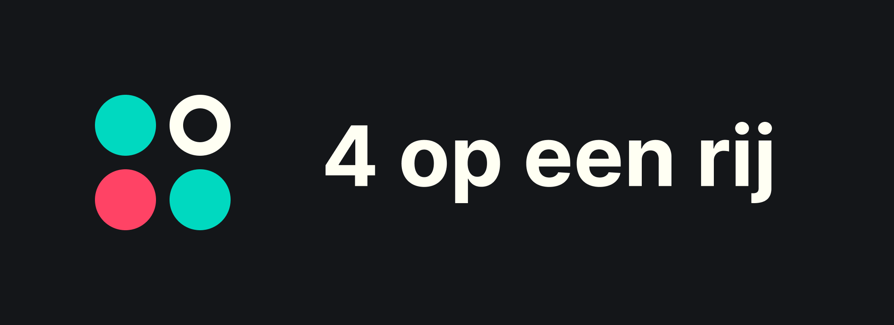
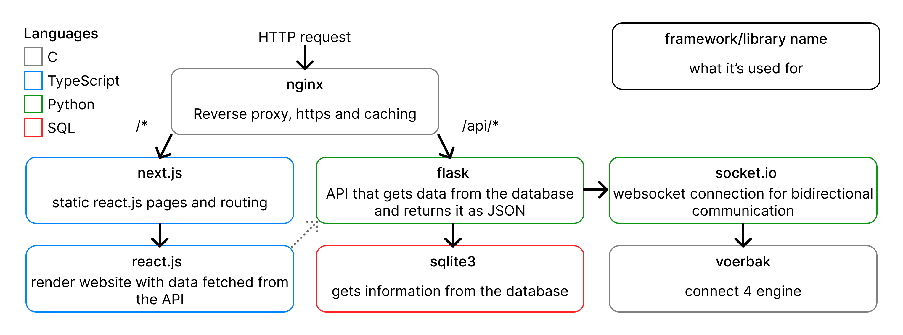

# PO connect-4



<p align="center">


</p>

> Some of this project's code is in Dutch (commit messages, documents etc.),
> along with the whole website. This was originally a school project, but I'm
> going to keep maintaining this project during my exams and summer break

## Planned features:

- [x] working connect 4 game
- [x] client-server connection with socket.io
- [x] account creation
- [ ] anonymous accounts
- [x] invite links
- [x] safe password authentication
- [ ] play against the computer
- [x] follow people/add as friend
- [ ] game rating like on chess.com
- [x] rest api that handles all of this instead of some janky solution
- [ ] Messages
- [ ] Multiple game modes
- [ ] Themes
- [ ] Animations

## Used libraries and frameworks:

- [Flask](https://flask.palletsprojects.com/) for the REST API
- [ReactJS](https://reactjs.org/) to create the website
- [NextJS](https://nextjs.org/) for static react pages and html page routing
- [socket.io](https://socket.io/) for bidirecitonal communication during a game
- [SQLite](https://sqlite.org/index.html) for the database
- [nginx](https://nginx.org/en/) for serving static files generated by nextjs,
  caching and reverse proxy

A design prototype of the website can be found on
[Figma](https://www.figma.com/file/rTciVQApAe6cwrH1Prl5Wn/4-op-een-rij?node-id=0%3A1).
An outdated version of the API documentation is still on Google Docs, but I'm
moving and updating it to be in api/readme.md.



## setup

To set up this project you'll need to install npm and pip dependencies, pull all
git submodules and compile voerbak and the sql extensions.

> I haven't figured out how to run this project on Windows, so please install
> [WSL](https://docs.microsoft.com/en-us/windows/wsl/install-win10) if you want
> to run this yourself on Windows. The distro you choose doesn't matter, though
> package names in ./configure may vary if your distro doesn't use the apt
> package manager.

### automatic setup using `./configure` (debian/ubuntu)

This script might also work on other distro's using the `apt` package manager.
To start the setup process you only need to run the following command:

```sh
./configure
```

The script calls sudo and apt install so some password input/manual confirmation
is required, but most of the install should be automated.

### manual setup (other distro's)

If your disto doesn't use the `apt` package manager, you can still run this
project by following these steps:

0. `git clone https://github.com/lonkaars/po-4-op-een-rij`
1. Make sure you have [python](https://python.org/downloads) (with pip and venv)
   installed.
2. Make sure you have [nodejs](https://nodejs.org/en/download) (with npm)
   installed.
3. Make sure you have [nginx](https://nginx.org/en/) installed.
4. Make sure you have [make](https://www.gnu.org/software/make/) and the gnu c
   compilers [gcc](https://gcc.gnu.org/) installed (most distro's will have
   these by default).
5. Install typescript, react-scripts and yarn:
   ```sh
   npm i -g typescript yarn
   ```
6. Create a new python virtual environment and install pip modules:
   ```sh
   python -m venv venv
   source venv/bin/activate
   pip install -r requirements.txt
   ```
7. Install node modules:
   ```sh
   yarn
   ```
8. Build voerbak:
   ```sh
   cd voerbak
   make
   ```
9. Download submodules:
   ```sh
   git submodule init
   git submodule update
   ```
10. Initialize database and build SQL extensions:
    ```sh
    cd database
    ./init_db.sh
    make
    ```

## How to start

In order to start this project you'll need three terminal windows to start the
flask server, react server, and nginx seperately:

```sh
# term 1
source venv/bin/activate
python3 api/main.py

# term 2
yarn dev

# term 3
sudo nginx -c $PWD/nginx.conf

# if nginx can't run as the user nobody, try running the following command and restart nginx:
# this command is also in ./configure
sed "s/user nobody/user $(whoami)/" -i nginx.conf
```
