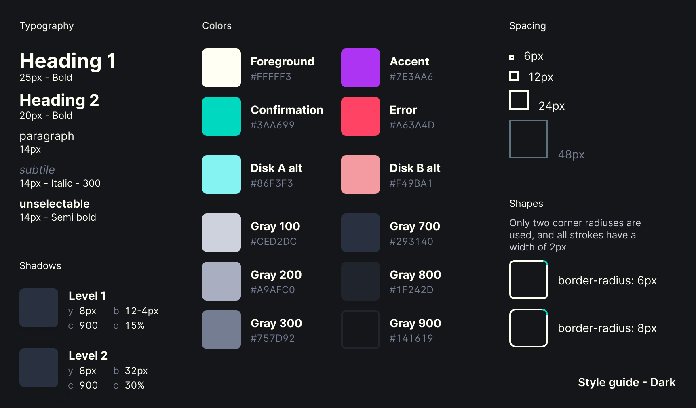
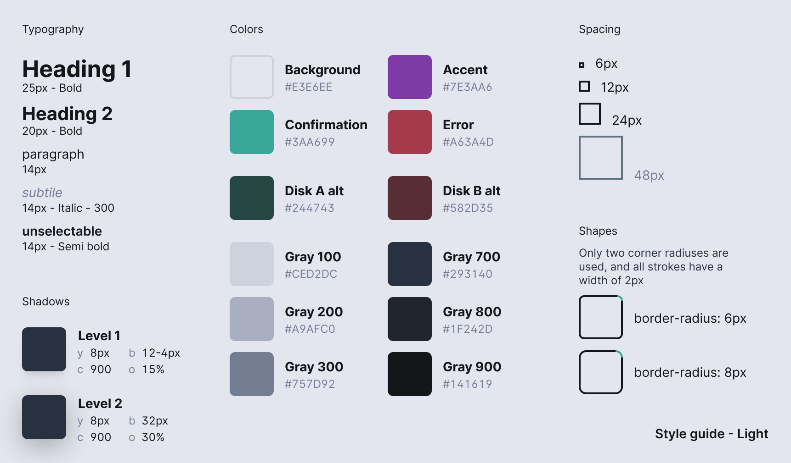

# Styles

This is the folder where all website css should be. Currently most of the css is
done using inline styles in the .tsx files, but they're being moved to seperate
.css files in here. A redesign has also been in the making and we now have a
style guide to follow while writing the website:

## Dark



## Light



The new designs can be found on
[Figma](https://www.figma.com/file/rTciVQApAe6cwrH1Prl5Wn/4-op-een-rij?node-id=0%3A1).
The Figma designs are in dark mode, but the website will (for now) still have
light mode as it's default theme.

After the move to .css files is done I'll also start working on the new theming
settings, and allow custom themes to be created with css that can easily be
selected in the settings page instead of having to copy-paste color codes
manually.

## Show me the css

These will eventually be moved to global.css when the move to .css files is
done.

```css
:root {
	--background: #E3E6EE;
	--foreground: var(--gray-900);

	--accent: #7E3AA6;

	--error: #A63A4D;
	--disk-b-alt: #582D35;

	--confirm: #3AA699;
	--disk-a-alt: #244743;
}

@media (prefers-color-scheme: dark) {
	:root {
		--background: var(--gray-900);
		--foreground: #FFFFF3;

		--accent: #AD34F3;

		--error: #FF4365;
		--disk-b-alt: #F49BA1;

		--confirm: #00D9C0;
		--disk-a-alt: #86F3F3;
	}
}

:root {
	/* shade */
	--gray-100: #CED2DC;
	--gray-200: #A9AFC0;
	--gray-300: #757D92;
	--gray-700: #293140;
	--gray-800: #1F242D;
	--gray-900: #141619;

	/* box-shadow */
	--drop-level-2: 0px 8px 32px 0px  rgba(0, 0, 0, 0.3);
	--drop-level-1: 0px 8px 12px -4px rgba(0, 0, 0, 0.15);

	/* border-radius */
	--tight-corner: 6px;
	--loose-corner: 8px;

	/* margin/padding */
	--spacing-small:  6px;
	--spacing-medium: 12px;
	--spacing-large:  24px;
}

html {
	font-family: "Inter", sans-serif;
	font-size: 14px;
}

/* headings */
h1, h2, h3 { font-weight: 700; }
h1 { font-size: 25px; }
h2 { font-size: 20px; }

.subtile {
	color: var(--gray-300);
	font-style: italic;
}

/* no-select */
.nosel {
	user-select: none;
	font-weight: 600;
}
```
